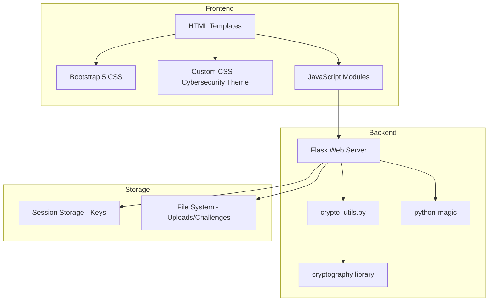
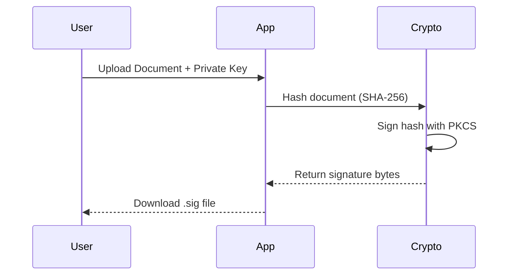

# Digital Signature Verifier - Project Report

> **Author**: Mostafa ELSaeed  
> **Supervisor**: Dr. Tamer Mostafa  
> **Domain**: Cyber Forensics Lab  
> **Date**: January 2026

---

## 1. Executive Summary

The **Digital Signature Verifier** is a web-based application designed to educate users about RSA digital signatures through hands-on experience. It provides tools for generating cryptographic key pairs, signing documents, and verifying signatures—all critical operations in modern cybersecurity and digital forensics.

---

## 2. Project Purpose & Use Cases

### 2.1 Educational Objectives
- Teach the fundamentals of **public-key cryptography** (RSA)
- Demonstrate the **signing and verification workflow**
- Provide practical experience with **document integrity validation**

### 2.2 Real-World Applications
| Use Case | Description |
|----------|-------------|
| **Document Authentication** | Verify that a contract, certificate, or legal document hasn't been tampered with |
| **Non-Repudiation** | Prove that a specific private key owner signed a document |
| **Forensic Analysis** | Detect forged or modified documents in investigations |
| **Software Distribution** | Verify the integrity of downloaded files |

---

## 3. Technical Architecture



### 3.1 System Components

| Component | Technology | Purpose |
|-----------|-----------|---------|
| **Web Framework** | Flask 3.0.0 | HTTP routing, template rendering, session management |
| **Cryptography** | cryptography 41.0.7 | RSA key generation, signing, verification |
| **File Validation** | python-magic-bin 0.4.14 | MIME type detection via magic numbers |
| **Frontend Framework** | Bootstrap 5.3.0 | Responsive UI components |
| **Client-Side Crypto** | JSEncrypt 3.3.2 | Browser-based RSA operations |

---

## 4. Cryptographic Implementation

### 4.1 RSA Key Generation

```python
# From crypto_utils.py
private_key = rsa.generate_private_key(
    public_exponent=65537,      # Standard Fermat prime (F4)
    key_size=2048,              # Industry-standard key length
    backend=default_backend()
)
```

**Key Parameters**:
- **Public Exponent**: 65537 (0x10001) - chosen for security and performance
- **Key Size**: 2048 bits (configurable: 1024, 3072, 4096)
- **Format**: PEM-encoded PKCS#8 (private), SubjectPublicKeyInfo (public)

### 4.2 Digital Signature Process



**Algorithm Details**:
1. **Hashing**: SHA-256 (256-bit digest) applied in 4KB chunks for memory efficiency
2. **Padding**: PKCS#1 v1.5 (deterministic, widely compatible)
3. **Signing**: RSA private key operation on pre-hashed digest

```python
# Signing implementation
signature = private_key.sign(
    file_hash.digest(),
    padding.PKCS1v15(),
    utils.Prehashed(hashes.SHA256())
)
```

### 4.3 Signature Verification

```python
# Verification implementation
public_key.verify(
    signature,
    file_hash.digest(),
    padding.PKCS1v15(),
    utils.Prehashed(hashes.SHA256())
)
```

**Verification Outcomes**:
- ✅ **Valid**: Hash matches → document is authentic and unmodified
- ❌ **Invalid**: Hash mismatch → document was tampered OR wrong key used

---

## 5. Security Features

### 5.1 File Validation
```python
# Magic number validation (not just extension checking)
mime = magic.from_buffer(file_stream.read(2048), mime=True)
```

**Allowed MIME Types**:
- `text/plain` - Text files
- `application/pdf` - PDF documents
- `application/msword` - DOC files
- `application/vnd.openxmlformats-officedocument.wordprocessingml.document` - DOCX
- `image/jpeg`, `image/png` - Images
- `application/octet-stream` - Binary/key files

### 5.2 Session Security
- **Secret Key**: Cryptographically random 256-bit hex token
- **Key Storage**: Session-only (not persisted to disk)
- **Privacy**: Keys never stored on server permanently

### 5.3 File Permissions
```python
os.chmod(private_path, 0o600)  # Owner read/write only
os.chmod(signature_path, 0o644) # Owner write, all read
```

---

## 6. Project File Structure

```
sv3/
├── app.py                      # Flask application (372 lines)
├── crypto_utils.py             # Cryptographic functions (126 lines)
├── requirements.txt            # Python dependencies
├── test_hashing.py             # Hash function tests
├── test_signature.py           # Signature operation tests
│
├── templates/                  # Jinja2 HTML templates
│   ├── base.html               # Base template with navbar
│   ├── index.html              # Home page
│   ├── generate_keys.html      # Key generation UI
│   ├── sign_document.html      # Document signing UI
│   ├── verify_signature.html   # Signature verification UI
│   ├── challenges.html         # Forensic challenges list
│   ├── challenge.html          # Individual challenge view
│   ├── keys.html               # Generated keys display
│   ├── signature_result.html   # Signing result page
│   └── verification_result.html # Verification result page
│
├── static/
│   ├── css/
│   │   └── style.css           # Cybersecurity-themed styles
│   └── js/
│       ├── generate_keys.js    # Client-side key generation
│       ├── sign_document.js    # Client-side signing
│       ├── verify_signature.js # Client-side verification
│       └── script.js           # Common utilities
│
├── challenges/                 # Forensic challenge files
│   └── challenge_01/
│       ├── description.txt
│       └── suspect.txt
│
└── uploads/                    # Temporary file storage
```

---

## 7. Dependencies

| Package | Version | Purpose |
|---------|---------|---------|
| **Flask** | 3.0.0 | Web framework |
| **flask-cors** | 4.0.0 | Cross-origin resource sharing |
| **python-magic-bin** | 0.4.14 | File type detection (Windows binary) |
| **cryptography** | 41.0.7 | RSA operations |
| **Werkzeug** | 3.0.1 | WSGI utilities, secure filename handling |

---

## 8. API Endpoints

| Route | Method | Description |
|-------|--------|-------------|
| `/` | GET | Home page |
| `/generate_keys` | GET | Key generation form |
| `/generate_keys` | POST | Generate new key pair |
| `/keys` | GET | Display generated keys |
| `/download_key/<type>` | GET | Download public/private key |
| `/sign_document` | GET/POST | Sign a document |
| `/download_signature` | GET | Download signature file |
| `/verify_signature` | GET/POST | Verify a signature |
| `/challenges` | GET | List forensic challenges |
| `/challenge/<id>` | GET | View specific challenge |
| `/download_challenge_file/<id>/<file>` | GET | Download challenge file |

---

## 9. User Interface Theme

The application features a **cybersecurity-inspired dark theme**:

| Element | Style |
|---------|-------|
| **Background** | Deep black (#0a0a0a) |
| **Primary Color** | Neon green (#00ff41) |
| **Cards** | Dark gray with green top border |
| **Text** | Pure white (#ffffff) |
| **Effects** | Glowing shadows, scanline overlay |

---

## 10. How to Run

### Prerequisites
- Python 3.8+
- pip package manager

### Installation
```bash
cd sv3
pip install -r requirements.txt
```

### Execution
```bash
python app.py
```

### Access
Open browser to: `http://127.0.0.1:5000`

---

## 11. Testing

```bash
# Run hash function tests
python test_hashing.py

# Run signature tests
python test_signature.py
```

**Test Coverage**:
- ✅ File hashing (SHA-256)
- ✅ Key generation and loading
- ✅ Signature creation
- ✅ Signature verification (valid/invalid cases)
- ✅ Key type validation (public vs private)

---

## 12. Conclusion

The Digital Signature Verifier successfully demonstrates the practical application of RSA cryptography for document authentication. By combining a modern Flask backend with client-side JavaScript cryptography, users gain hands-on experience with the complete digital signature workflow—from key generation through verification—in a secure, educational environment.

---

*Report generated for Cyber Forensics Lab coursework.*
